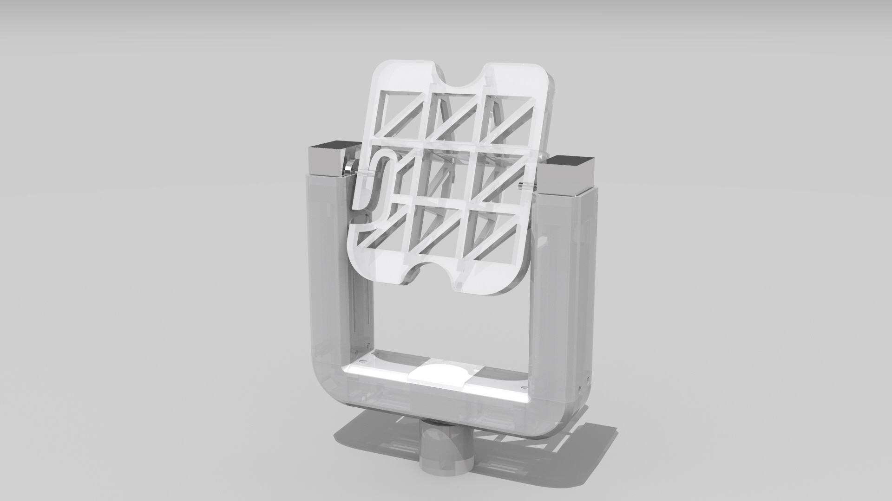
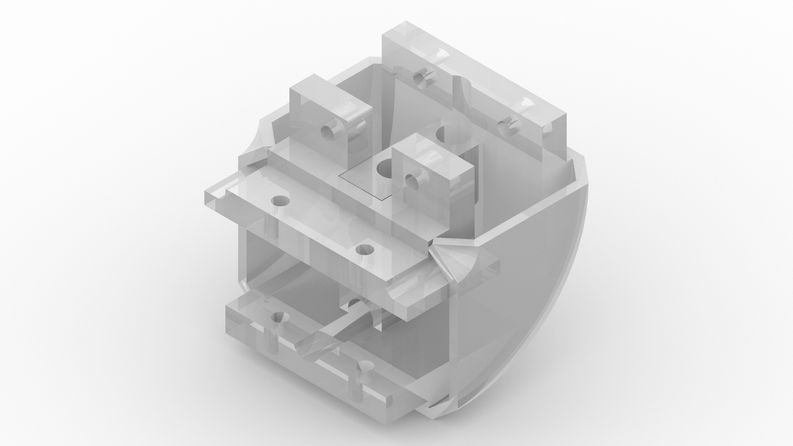
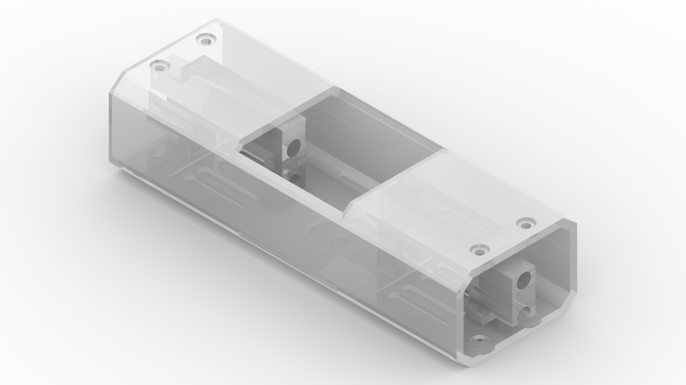
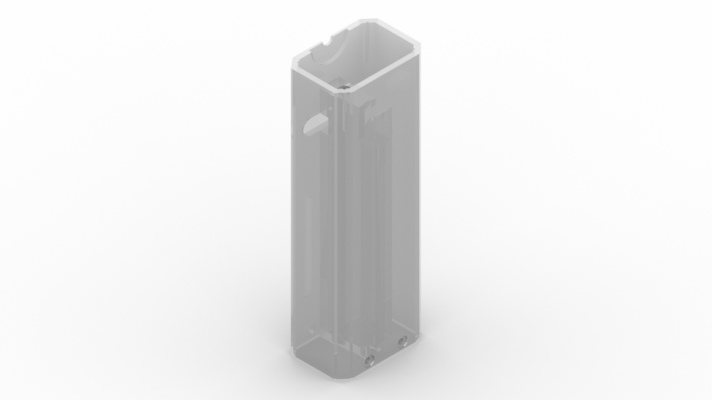
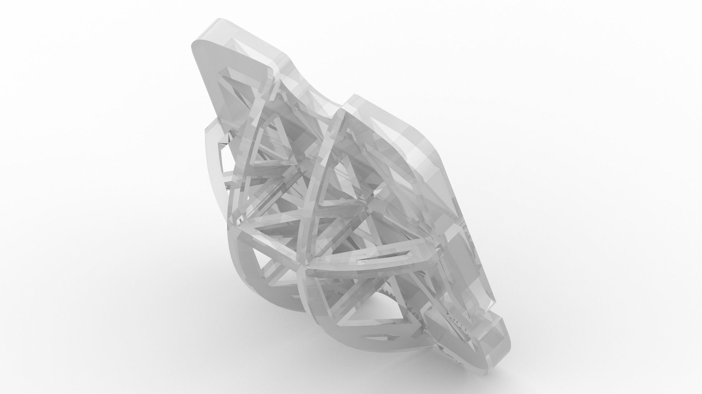

# betastation
betastation is a compact and powerful base station designed for long-range FPV use and fully 3D printable

## Overview

## How to construct the betastation

### BOM

#### The bill of materials for the antenna tracker

| Quantity | REF | description | Link |
|:--------:|:----:|:----------:|:----:|
| 3 | 17HS2408S       | nema 17 |  [Banggood](https://www.banggood.com/HANPOSE-28mm-Nema-17-Stepper-Motor-42-Motor-17HS2408-42BYGH-0_6A-12N_cm-4-lead-For-CNC-Laser-3D-Printer-Motor-p-1415423.html?rmmds=myorder&cur_warehouse=CN) |
| 2 | TMC2208         | TMC2208 V1.2 Stepper Motor driver Module | [Banggood](https://www.banggood.com/TMC2208-V1_2-Stepper-Motor-Driver-Module-Stepstick-Smoother-Heatsink-For-3D-Printer-Parts-p-1383270.html?rmmds=myorder) |
| 2 | Fan 30x30x10mm  | Hobbywing 5V-7V 150A DC Cooling Fan | [Banggood](https://www.banggood.com/Hobbywing-5V-7V-150A-DC-Cooling-Fan-For-RC-Model-Motor-ESC-253040mm-Power-Transfer-p-1067266.html?rmmds=myorder&ID=47280&cur_warehouse=CN) |
| 1 | Telemetry TX/RX | LoRa1280F27 2.4GHz 500mW 27dBm LoRa Transceiver Module | [Banggood](https://www.banggood.com/LoRa1280F27LoRa1281F27-2_4GHz-500mW-27dBm-LoRa-Chip-RF-Wireless-Transceiver-Module-For-RC-Airplane-p-1403033.html?rmmds=myorder&ID=564633&cur_warehouse=CN) |

#### The bill of materials for the ground station

| Quantity | REF | description | Link |
|:--------:|:----:|:----------:|:----:|
| 1 | Orange Pi 2G-IOT | Main controller Orange Pi 2G-IOT ARM Cortex-A5 32bit | [Aliexpress](https://de.aliexpress.com/item/32802458477.html?storeId=1553371&spm=a2g0x.12010612.8148356.1.795a11f5d0n4Y8) |
| 1 | TFT | 3.97 inch TFT screen with touchscreen | [Aliexpress](https://de.aliexpress.com/item/32816194245.html?storeId=1553371&spm=a2g0x.12010612.8148356.2.60066edfa4YBgq) |
| 1 | TVIN | TVIN camera adapter | Available soon |
| 1 | Video RX | Any fatshark compatible receiver | |
| 1 | Video Repeater | 25mw video tx to re-transmit the video without wires | [Banggood](https://www.banggood.com/16x16mm-Hole-EWRF-7081U16-5_8G-48CH-25mW-Mini-Power-Audio-Video-FPV-VTX-Transmitter-7-24V-p-1369409.html?rmmds=search&cur_warehouse=CN) |

### 3D Printing the station

All the parts to construct betastation can be found in thingiverse.

#### Parts

The ground station consists mainly of five parts that have to be assembled and screwed together.

| Part | description |
|:----:|:-----------:|
|  | Curve to fix the pillars to the base |
|  | Base to fix the curves |
|  | Support pillar for stepper motors (left and right) |
|  | Main bracket for attaching to a tripod with suction cups |
|  | Frame to hold the antenna and ground station |

## How to program the betastation

All the software developed for betastation is written in python. This will allow everyone to modify and make the most of the station's capabilities.

The betastation firmware is built using Buildroot.

