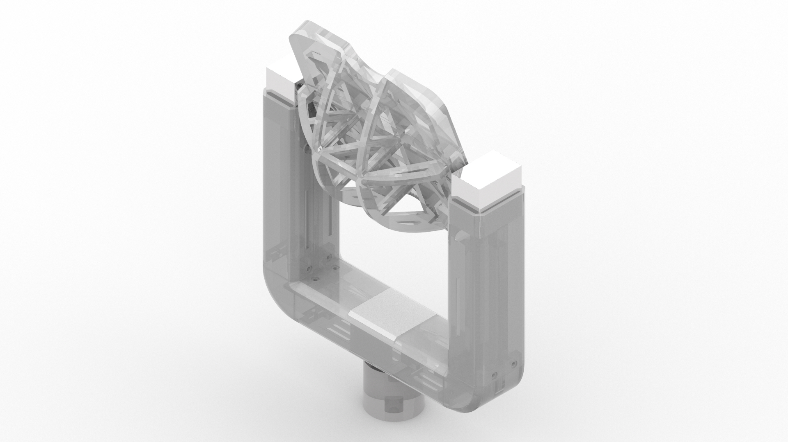

# betastation
betastation is a compact and powerful base station designed for long-range FPV use

## Overview

## How to construct one betastation

### BOM

The bill of materials is as follows:

| Quantity | REF | description | Link |
|:--------:|:----:|:----------:|:----:|
| 3 | 17HS2408S       | nema 17 |  [Banggood](https://www.banggood.com/HANPOSE-28mm-Nema-17-Stepper-Motor-42-Motor-17HS2408-42BYGH-0_6A-12N_cm-4-lead-For-CNC-Laser-3D-Printer-Motor-p-1415423.html?rmmds=myorder&cur_warehouse=CN) |
| 2 | TMC2208         | TMC2208 V1.2 Stepper Motor driver Module | [Banggood](https://www.banggood.com/TMC2208-V1_2-Stepper-Motor-Driver-Module-Stepstick-Smoother-Heatsink-For-3D-Printer-Parts-p-1383270.html?rmmds=myorder) |
| 2 | Fan 30x30x10mm  | Hobbywing 5V-7V 150A DC Cooling Fan | [Banggood](https://www.banggood.com/Hobbywing-5V-7V-150A-DC-Cooling-Fan-For-RC-Model-Motor-ESC-253040mm-Power-Transfer-p-1067266.html?rmmds=myorder&ID=47280&cur_warehouse=CN) |
| 1 | Telemetry TX/RX | LoRa1280F27 2.4GHz 500mW 27dBm LoRa Transceiver Module | [Banggood](https://www.banggood.com/LoRa1280F27LoRa1281F27-2_4GHz-500mW-27dBm-LoRa-Chip-RF-Wireless-Transceiver-Module-For-RC-Airplane-p-1403033.html?rmmds=myorder&ID=564633&cur_warehouse=CN) |

### Printing the station

The frame for betastation can be found in thingiverse.
